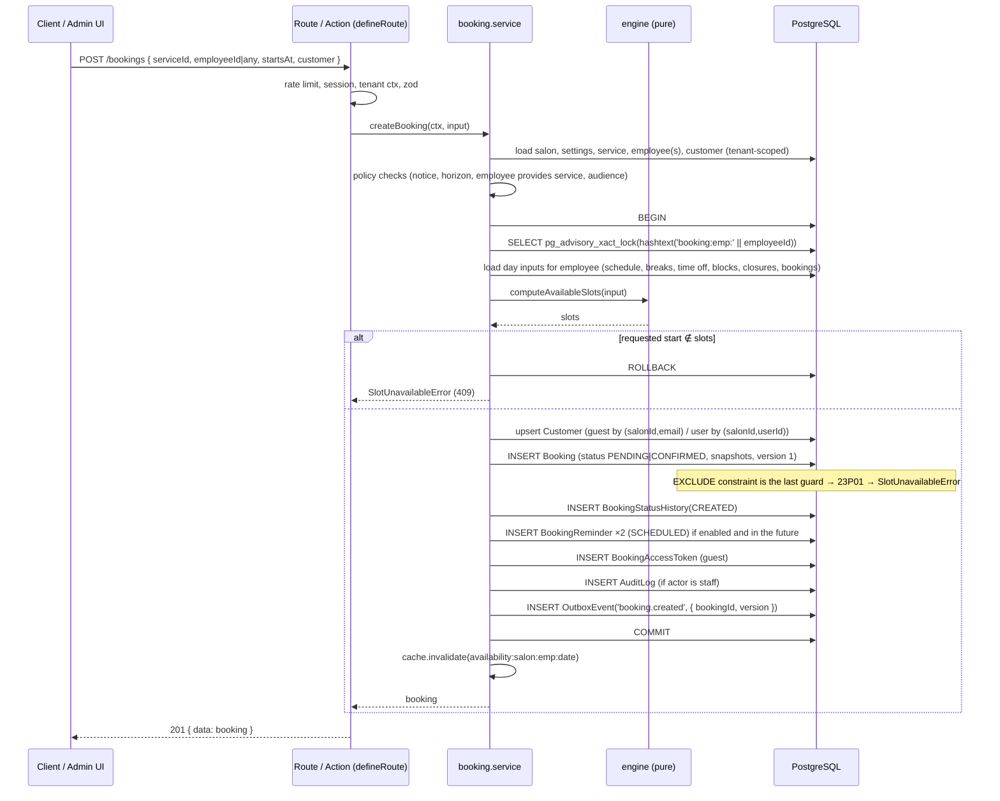
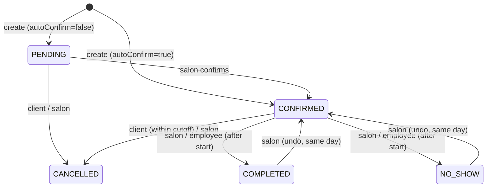

# Booking System

The booking engine is the core of the product. It is not a CRUD layer: it understands salon hours, employee schedules, breaks, time off, closures, blocked times, existing bookings, service duration and buffers, booking interval, notice and horizon, timezones and DST, and the salon's cancellation policy.

Related: [database.md](./database.md) (tables), [notifications.md](./notifications.md) (what happens after a booking), [testing.md](./testing.md) (test matrix).

---

## 1. Concepts

| Term          | Meaning                                                                                                                                      |
| ------------- | -------------------------------------------------------------------------------------------------------------------------------------------- |
| Instant       | A UTC point in time (`Date`). All persisted times.                                                                                           |
| Wall-clock    | `"HH:mm"` in the salon timezone on a given local date. Schedules and opening hours.                                                          |
| Interval      | `[start, end)` half-open pair of instants. All engine math is interval math.                                                                 |
| Slot          | A candidate booking start instant offered to the client, with its computed end.                                                              |
| Slot interval | `SalonSettings.slotIntervalMinutes` — the step between offered starts (e.g. 15/30/60).                                                       |
| Duration      | Service duration (with employee override) in minutes.                                                                                        |
| Buffer        | `Service.bufferAfterMinutes + SalonSettings.bufferMinutes`; added to the booked interval so the next booking cannot start immediately after. |
| Notice        | `minBookingNoticeMinutes` — earliest allowed start relative to `now`.                                                                        |
| Horizon       | `maxBookingAdvanceDays` — last allowed local date.                                                                                           |

---

## 2. Module layout

```
modules/booking/
├─ engine/                     PURE (no I/O, no Date.now(), no Prisma)
│  ├─ intervals.ts             union, subtract, intersect, clamp
│  ├─ working-time.ts          wall-clock schedule → UTC intervals for a local date
│  ├─ availability.ts          computeAvailableSlots(input) → Slot[]
│  ├─ any-employee.ts          union across employees + selection strategy
│  ├─ policies.ts              canClientCancel/Reschedule, isWithinNotice, isWithinHorizon
│  └─ state-machine.ts         allowed status transitions per actor
├─ availability.service.ts     loads inputs (tenant-scoped) and calls the engine; caches
├─ booking.service.ts          createBooking, rescheduleBooking, cancelBooking, changeStatus
├─ repository.ts               Prisma queries incl. the two raw helpers (advisory lock, overlap fetch)
├─ schemas.ts                  Zod: CreateBookingInput, RescheduleInput, AvailabilityQuery, …
├─ errors.ts                   SlotUnavailableError, PolicyViolationError, InvalidTransitionError
└─ permissions.ts
```

The engine folder is covered by exhaustive unit tests and is the only place where availability rules are expressed. The service re-runs the same engine inside the write transaction, so the read path and the write path can never disagree.

---

## 3. Availability algorithm

### Signature

```ts
type AvailabilityInput = {
  localDate: string; // "YYYY-MM-DD" in salon timezone
  timezone: string; // IANA
  now: Date; // injected
  salonHours: WeeklyHours; // per weekday { opensAt, closesAt, isClosed }
  salonClosures: Interval[]; // UTC
  employee: {
    id: string;
    schedule: ScheduleBlock[]; // { weekday, startTime, endTime, validFrom?, validUntil? }
    breaks: BreakBlock[]; // { weekday, startTime, endTime }
    timeOff: Interval[]; // UTC
    blockedTimes: Interval[]; // UTC (employee-specific + salon-wide)
    bookings: Interval[]; // UTC, status PENDING|CONFIRMED, already include buffer
  };
  service: { durationMinutes: number; bufferMinutes: number };
  settings: {
    slotIntervalMinutes: number;
    minBookingNoticeMinutes: number;
    maxBookingAdvanceDays: number;
  };
  exclude?: { bookingId: string; interval: Interval }; // when rescheduling, ignore the booking's own interval
};

type Slot = { startsAt: Date; endsAt: Date; employeeId: string };

function computeAvailableSlots(input: AvailabilityInput): Slot[];
```

### Steps

1. **Horizon and notice gate.** If `localDate` is before today (in salon tz) or after `today + maxBookingAdvanceDays`, return `[]`. Compute `earliestStart = now + minBookingNoticeMinutes`.
2. **Local day bounds.** `dayStart = wallClockToUtc(localDate, "00:00", tz)`, `dayEnd = wallClockToUtc(localDate + 1 day, "00:00", tz)`. (Day length may be 23 h or 25 h on DST days.)
3. **Salon opening intervals.** For the weekday of `localDate`, if `isClosed` → `[]`. Else `[wallClockToUtc(localDate, opensAt), wallClockToUtc(localDate, closesAt))`. Subtract `salonClosures`.
4. **Employee working intervals.** All `schedule` blocks for that weekday whose validity window contains `localDate`, converted to UTC intervals. Intersect with the salon intervals from step 3 (an employee can never be bookable while the salon is closed).
5. **Subtract unavailability.** `working = subtract(working, breaks ∪ timeOff ∪ blockedTimes)`.
6. **Subtract existing bookings.** `free = subtract(working, bookings minus exclude)`. Booking intervals already include their buffer (`endsAt` in the DB includes it).
7. **Generate candidate starts.** For each free interval `[a, b)`: starts at `alignUp(a, slotInterval)` then every `slotIntervalMinutes`, while `start + duration + buffer <= b`. Alignment is done on the **local wall-clock minute of day** so slots read as 09:00, 09:30 … regardless of DST or a schedule that begins at 09:10 (the first slot would be 09:15 for a 15-minute interval).
8. **Notice filter.** Drop starts `< earliestStart`.
9. Return sorted, de-duplicated slots with `endsAt = startsAt + duration` (the client sees the service end; the buffer is internal).

### Complexity

Linear in number of intervals plus number of candidates (≤ 288 for a 5-minute step). Trivially fast; the cost is in loading inputs, which is one indexed query per table for a single employee/day.

---

## 4. Worked examples

### Example A — the case from the brief

- Employee works 09:00–17:00, salon open 08:00–20:00, no breaks.
- Service: 60 min, no buffer. Slot interval: 60 min.
- Existing booking: 10:00–11:00.

Free intervals after step 6: `[09:00, 10:00)`, `[11:00, 17:00)`.
Candidates: 09:00 (fits: 09:00–10:00 ≤ 10:00 ✓); 11:00, 12:00, 13:00, 14:00, 15:00, 16:00 (16:00–17:00 ≤ 17:00 ✓); 17:00 ✗.

**Result:** 09:00, 11:00, 12:00, 13:00, 14:00, 15:00, 16:00 — exactly as specified.

### Example B — 30-minute interval, 45-minute service, lunch break

- Employee 09:00–17:00, break 13:00–13:30, existing booking 10:00–11:00, service 45 min, interval 30 min.
- Free: `[09:00, 10:00)`, `[11:00, 13:00)`, `[13:30, 17:00)`.
- `[09:00,10:00)`: 09:00 ✓ (ends 09:45), 09:30 ✗ (ends 10:15).
- `[11:00,13:00)`: 11:00, 11:30, 12:00 ✓ (ends 12:45), 12:30 ✗.
- `[13:30,17:00)`: 13:30, 14:00, …, 16:00 ✓ (ends 16:45), 16:30 ✗.

**Result:** 09:00, 11:00, 11:30, 12:00, 13:30, 14:00, 14:30, 15:00, 15:30, 16:00.

### Example C — buffer

Service 30 min with 10 min buffer, interval 30 min, employee 09:00–11:00, no bookings.
Candidate 09:00: needs `09:00 + 40 ≤ 11:00` ✓. 09:30: `09:30 + 40 = 10:10 ≤ 11:00` ✓. 10:00: `10:40 ≤ 11:00` ✓. 10:30: `11:10` ✗.
A booking at 09:00 is stored as `[09:00, 09:40)`, so the next candidate that fits is 10:00 (09:30 would overlap the buffer).

### Example D — manual block

Employee 09:00–17:00; admin blocks 2026-10-10 13:00–15:00. Step 5 removes `[13:00, 15:00)`; a 60-minute service with 60-minute interval yields 09:00 … 12:00, then 15:00, 16:00. The 12:00 slot is kept because `12:00–13:00` ends exactly at the block start (half-open intervals).

---

## 5. Timezones and DST

- The salon timezone (`Salon.timezone`, IANA, default `Europe/Sarajevo`) is the only timezone used for interpretation. Clients see times in the salon timezone with an explicit label; the client's device timezone is irrelevant to booking (you visit the salon in person).
- `wallClockToUtc(localDate, "HH:mm", tz)` uses `@date-fns/tz` (`TZDate`) to produce the UTC instant for that wall-clock on that date. It is evaluated **per date**, so the same "09:00" is 07:00Z in summer and 08:00Z in winter.
- **Spring forward** (e.g. 2026-03-29 in Europe/Sarajevo, 02:00→03:00): wall-clock times in the non-existent hour resolve to the instant after the gap. Schedules that span the gap simply lose one hour of real time; candidate generation iterates in real minutes and alignment is by local minute-of-day, so no phantom 02:30 slot is produced.
- **Fall back** (e.g. 2026-10-25, 03:00→02:00): ambiguous wall-clock times resolve to the **first** occurrence (the DST instant). A schedule 09:00–17:00 is unaffected; a night schedule spanning 02:00 gets an extra real hour, and candidates are generated for it because we iterate instants. Documented in tests (`availability.dst.test.ts`).
- Storage is always UTC, so comparisons, the exclusion constraint and reminders (`startsAt − 24h`) are DST-proof.
- Changing a salon's timezone re-interprets future schedules; existing bookings keep their instants. The settings UI warns about this.

---

## 6. Booking transaction

Conflict prevention is layered:

1. **UI**: only shows engine-produced slots (convenience, never trusted).
2. **Service (read path)**: `availability.service` validates the requested slot before entering the transaction (fast rejection).
3. **Transaction with per-employee advisory lock**: serializes writers for the same employee and re-validates with fresh data.
4. **Database exclusion constraint**: the final guarantee; a violation is mapped to `SlotUnavailableError`.



Notes:

- The advisory lock key is derived from the employee id; salons and other employees are never blocked. `pg_advisory_xact_lock` is released automatically on commit/rollback.
- For **"Any available employee"**, the service first computes the candidate set (eligible employees who have the slot), then locks candidates **in a deterministic order** (sorted ids) one at a time, re-validates, and books the first that is still free. Selection strategy: fewest bookings on that day, then lowest `sortOrder` (round-robin fairness; strategy is a pluggable function).
- Isolation level stays `READ COMMITTED`; correctness comes from the lock + constraint, not from serializable retries.
- The outbox row is written in the same transaction, so notifications are emitted iff the booking committed.

### Reschedule

Same transaction shape, plus:

- `WHERE id = ? AND version = ?` optimistic check (409 `CONFLICT` if stale).
- Client actor: `policies.canClientReschedule(booking, settings, now)` — `startsAt − now ≥ rescheduleCutoffHours` and status ∈ {PENDING, CONFIRMED}.
- Locks the **old and new** employee (sorted to avoid deadlocks) when the employee changes.
- Engine is called with `exclude = { bookingId, interval }` so the booking's own slot counts as free (moving 10:00→10:30 must work).
- Updates `startsAt`, `endsAt`, `employeeId`, `version += 1`; history row `RESCHEDULED` with previous/new start.
- Reminders: existing `SCHEDULED` rows → `CANCELLED`; new rows created for the new time (see [notifications.md §5](./notifications.md#5-reminders)).
- Event `booking.rescheduled` with old and new times.
- The old slot becomes free automatically because the row's interval changed (the exclusion constraint only sees the new interval).

### Cancel

- Client/guest: `policies.canClientCancel` (cutoff, status). Salon staff: always, for PENDING/CONFIRMED.
- `status = CANCELLED`, `cancelledAt`, `cancelledBy`, `cancellationReason`, `version += 1`; history row; reminders → `CANCELLED`; event `booking.cancelled`.
- The row leaves the exclusion constraint's predicate, freeing the slot.

### Status changes

Allowed transitions (`state-machine.ts`):



| Actor                   | May set                                                    |
| ----------------------- | ---------------------------------------------------------- |
| Client / guest          | CANCELLED (policy)                                         |
| Employee (own bookings) | COMPLETED, NO_SHOW                                         |
| Owner / Admin           | any allowed transition                                     |
| System                  | nothing automatic in v1 (auto-complete is a future toggle) |

---

## 7. Availability API and caching

`GET /api/v1/salons/:slug/availability?serviceId&employeeId=<id>|any&date=YYYY-MM-DD`

- Loads inputs for the date with one query per table, bounded by `[dayStart − 1 day, dayEnd + 1 day)` to catch intervals crossing midnight.
- Response: `{ date, timezone, slots: [{ startsAt, endsAt, employeeId }], employees: [{ id, name }] }` — for `any`, slots carry the set of employee ids so the UI can show "with Marko or Ana".
- Cached 30 s per `(salonId, serviceId, employeeId|any, date)`; invalidated on any booking/blocked-time/time-off/schedule write touching that employee or salon and date. Clients always re-validate on submit, so stale cache can only cause a friendly 409, never a double booking.
- Month overview (`GET …/availability/summary?serviceId&employeeId&month=YYYY-MM`) returns per-day `hasSlots` booleans for the date picker, computed with the same engine.

---

## 8. Admin-side booking

Admins can create bookings on the calendar, including:

- **Walk-ins** (`source = WALK_IN`) with minimal customer info.
- Bookings **outside online rules** (inside notice window, shorter than horizon) — the engine is called with `settings` overridden (`minBookingNoticeMinutes = 0`) but working hours, blocks and overlaps are **still enforced**. Admins may explicitly force a booking outside working hours with `overrideWorkingHours: true` (audited); overlaps are never overridable because the constraint forbids them.
- Drag-to-move on the calendar → reschedule endpoint.

---

## 9. Policies (pure)

```ts
canClientCancel(booking, settings, now)      → { ok: true } | { ok: false, reason: 'CUTOFF_PASSED' | 'INVALID_STATUS' }
canClientReschedule(booking, settings, now)  → same with rescheduleCutoffHours
isWithinNotice(startsAt, settings, now)
isWithinHorizon(localDate, settings, today)
employeeProvidesService(employee, service)   → checks EmployeeService and audience compatibility
resolveDurationAndPrice(service, employeeService?) → { durationMinutes, priceCents }
```

The UI calls the same functions (they are pure) to show "You can cancel until 21 Sep 19:00" and to hide buttons; the server re-evaluates them on every request.

---

## 10. Performance notes

- Calendar endpoints require `from`/`to` and cap ranges at 31 days; the month view fetches compact events (`id, startsAt, endsAt, status, employeeId`) only.
- Availability loads only one employee-day (or N employee-days for "any"), never the year.
- `Booking.endsAt` includes buffer so overlap queries need no arithmetic.
- Denormalized `Customer.lastBookingAt` avoids a subquery on the customers list default sort.
- Indexes are listed in [database.md §8](./database.md#8-query-patterns-and-indexes).

---

## 11. Edge cases covered by tests

- Booking that ends exactly when a block/booking starts (allowed, half-open).
- Service longer than any free gap (no slots).
- Schedule starting at 09:10 with 15-minute interval (first slot 09:15).
- Employee schedule extends beyond salon hours (clamped).
- Salon closure covering part of the day.
- Time off spanning multiple days including the queried day boundaries.
- Blocked time for the whole salon (`employeeId = null`).
- DST spring-forward and fall-back days, schedule crossing midnight (`22:00–02:00`).
- Reschedule onto own slot and onto an adjacent overlapping slot.
- Concurrent creation for the same employee/time: exactly one succeeds (integration).
- "Any employee" when only one candidate remains free after locking.
- Cancel/reschedule exactly at the cutoff boundary (`≥` allowed).
- Inactive employee / inactive service / employee who does not provide the service → 422.
- Cross-tenant service or employee id → 404.
