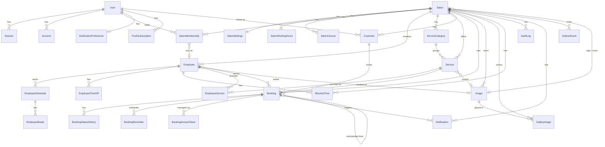

# Database Schema

PostgreSQL 16 · Prisma 6 · extensions: `btree_gist`, `pgcrypto`

Related: [architecture.md §6](./architecture.md#6-multi-tenancy) (tenant isolation), [booking-system.md](./booking-system.md) (how booking tables are used).

---

## 1. Conventions

| Topic                  | Rule                                                                                                                                                                                             |
| ---------------------- | ------------------------------------------------------------------------------------------------------------------------------------------------------------------------------------------------ |
| Primary keys           | `id String @id @default(uuid(7))` — UUID v7 for index locality.                                                                                                                                  |
| Tenant column          | `salonId` on every tenant-owned table, indexed, part of composite uniqueness `(salonId, id)`.                                                                                                    |
| Cross-tenant integrity | Cross-references inside a tenant use composite FKs `(salonId, xId) → X(salonId, id)` added in a raw SQL migration (Prisma models still declare the simple relation for the query API).           |
| Timestamps             | `createdAt DateTime @default(now())`, `updatedAt DateTime @updatedAt` on all mutable tables. All `DateTime` columns are `timestamptz` (Prisma default for Postgres).                             |
| Instants vs wall-clock | Instants (`startsAt`, `endsAt`, `sentAt`, …) are UTC. Recurring schedules use `weekday Int` (0 = Monday … 6 = Sunday, ISO) and `"HH:mm"` strings interpreted in `Salon.timezone`.                |
| Money                  | Integer minor units (`priceCents Int`) plus `currency String(3)` (ISO 4217). Never floats.                                                                                                       |
| Soft delete            | Not used for tenant data; `isActive` flags cover business needs. Bookings are never deleted, only cancelled. Deleting an employee with bookings is refused; the employee is deactivated instead. |
| Naming                 | Prisma models in PascalCase, columns camelCase, mapped to `snake_case` tables/columns with `@@map` / `@map`.                                                                                     |
| Enums                  | Postgres native enums via Prisma `enum`.                                                                                                                                                         |
| JSON                   | `Json` columns are validated by Zod at the application boundary; their shape is documented per table.                                                                                            |

---

## 2. Enums

```prisma
enum PlatformRole        { SUPER_ADMIN }
enum SalonRole           { OWNER ADMIN EMPLOYEE }
enum Audience            { MALE FEMALE UNISEX }          // salon: who it serves; service/employee: who it is for
enum SalonStatus         { ACTIVE INACTIVE SUSPENDED }
enum BookingStatus       { PENDING CONFIRMED COMPLETED CANCELLED NO_SHOW }
enum BookingSource       { ONLINE ADMIN WALK_IN }
enum PaymentStatus       { NONE PENDING PAID REFUNDED }  // reserved for future payments; default NONE
enum TimeOffType         { VACATION SICK PERSONAL OTHER }
enum BlockedTimeSource   { MANUAL EXTERNAL }             // EXTERNAL reserved for calendar sync
enum NotificationChannel { EMAIL PUSH IN_APP }
enum NotificationType {
  BOOKING_CONFIRMED BOOKING_PENDING BOOKING_RESCHEDULED BOOKING_CANCELLED
  REMINDER_24H REMINDER_1H
  STAFF_NEW_BOOKING STAFF_BOOKING_CANCELLED STAFF_BOOKING_RESCHEDULED
}
enum NotificationStatus  { QUEUED SENT FAILED SKIPPED }
enum PushPlatform        { WEB IOS ANDROID }
enum ImagePurpose        { LOGO COVER GALLERY SERVICE EMPLOYEE AVATAR }
enum ImageStatus         { PROCESSING READY FAILED }
enum ReminderKind        { H24 H1 }
enum ReminderStatus      { SCHEDULED SENT CANCELLED SKIPPED }
enum OutboxStatus        { PENDING PUBLISHED FAILED }
```

---

## 3. Entity-relationship diagram



---

## 4. Tables

Column types are given in Prisma notation. `?` = nullable. Composite FKs are listed under **Constraints**.

### 4.1 Identity (not tenant-scoped)

#### User

Managed by Better Auth, extended with application fields.

| Column               | Type                   | Notes                             |
| -------------------- | ---------------------- | --------------------------------- |
| id                   | String PK              |                                   |
| email                | String @unique         | lowercase                         |
| emailVerified        | Boolean                |                                   |
| name                 | String                 | display name                      |
| firstName, lastName  | String?                |                                   |
| phone                | String?                | E.164                             |
| image                | String?                | OAuth avatar URL                  |
| locale               | String?                | `bs` / `en`; null → salon default |
| platformRole         | PlatformRole?          | `SUPER_ADMIN` or null             |
| isActive             | Boolean @default(true) | deactivated users cannot log in   |
| createdAt, updatedAt | DateTime               |                                   |

#### Session, Account, Verification

Standard Better Auth tables (`Session.token`, `expiresAt`, `ipAddress`, `userAgent`; `Account` for OAuth providers and the password hash; `Verification` for email verification / password reset tokens). Not modified.

#### SalonMembership

Assigns a salon role to a user.

| Column               | Type              | Notes                                                                                  |
| -------------------- | ----------------- | -------------------------------------------------------------------------------------- |
| id                   | String PK         |                                                                                        |
| userId               | String FK → User  |                                                                                        |
| salonId              | String FK → Salon |                                                                                        |
| role                 | SalonRole         |                                                                                        |
| employeeId           | String?           | set when role = EMPLOYEE; composite FK `(salonId, employeeId) → Employee(salonId, id)` |
| invitedById          | String? FK → User |                                                                                        |
| createdAt, updatedAt | DateTime          |                                                                                        |

Constraints: `@@unique([userId, salonId])`, `@@index([salonId, role])`.

#### NotificationPreference

| Column          | Type                    | Notes                            |
| --------------- | ----------------------- | -------------------------------- |
| userId          | String PK FK → User     | one row per user, created lazily |
| emailEnabled    | Boolean @default(true)  |                                  |
| pushEnabled     | Boolean @default(false) | true once a subscription exists  |
| reminder24h     | Boolean @default(true)  |                                  |
| reminder1h      | Boolean @default(true)  |                                  |
| marketingEmails | Boolean @default(false) | future use                       |
| updatedAt       | DateTime                |                                  |

#### PushSubscription

| Column     | Type             | Notes                                                           |
| ---------- | ---------------- | --------------------------------------------------------------- |
| id         | String PK        |                                                                 |
| userId     | String FK → User |                                                                 |
| platform   | PushPlatform     | `WEB` today                                                     |
| endpoint   | String @unique   | Web Push endpoint URL, or device token for native               |
| p256dh     | String?          | Web Push key                                                    |
| auth       | String?          | Web Push auth secret                                            |
| userAgent  | String?          |                                                                 |
| locale     | String?          |                                                                 |
| lastSeenAt | DateTime         |                                                                 |
| failedAt   | DateTime?        | set on 404/410 from push service; row purged by maintenance job |
| createdAt  | DateTime         |                                                                 |

### 4.2 Tenant root

#### Salon

| Column                             | Type                               | Notes                                                                                      |
| ---------------------------------- | ---------------------------------- | ------------------------------------------------------------------------------------------ |
| id                                 | String PK                          |                                                                                            |
| slug                               | String @unique                     | URL `/salon/{slug}`, lowercase, immutable after publish (history table can be added later) |
| name                               | String                             |                                                                                            |
| description                        | String?                            | sanitized rich text (limited HTML)                                                         |
| category                           | String?                            | e.g. `barbershop`, `hair-salon`, `beauty-salon`                                            |
| audience                           | Audience                           | MALE / FEMALE / UNISEX; drives default service filters and copy                            |
| address, city, postalCode, country | String?                            | country ISO-3166 alpha-2                                                                   |
| latitude, longitude                | Float?                             |                                                                                            |
| googleMapsUrl                      | String?                            |                                                                                            |
| phone, email, website              | String?                            |                                                                                            |
| instagram, facebook, tiktok        | String?                            | full URLs                                                                                  |
| logoImageId                        | String?                            | composite FK → Image                                                                       |
| coverImageId                       | String?                            | composite FK → Image                                                                       |
| brandColor                         | String?                            | hex, optional accent on public page                                                        |
| timezone                           | String @default("Europe/Sarajevo") | IANA name, validated                                                                       |
| currency                           | String @default("BAM")             | ISO 4217                                                                                   |
| defaultLocale                      | String @default("bs")              |                                                                                            |
| status                             | SalonStatus @default(ACTIVE)       | INACTIVE hides public page; SUSPENDED also blocks admin                                    |
| plan                               | String?                            | reserved for subscription plans                                                            |
| createdAt, updatedAt               | DateTime                           |                                                                                            |

Indexes: `@@index([status])`, `@@index([city])`.

#### SalonSettings

Booking and notification policy. One row per salon, created with the salon.

| Column                     | Type                 | Default | Notes                                                      |
| -------------------------- | -------------------- | ------- | ---------------------------------------------------------- |
| salonId                    | String PK FK → Salon |         |                                                            |
| slotIntervalMinutes        | Int                  | 30      | step between offered start times (5–120)                   |
| minBookingNoticeMinutes    | Int                  | 60      | earliest bookable start = now + this                       |
| maxBookingAdvanceDays      | Int                  | 60      | booking horizon                                            |
| cancellationCutoffHours    | Int                  | 12      | client cancel allowed if start − now ≥ this                |
| rescheduleCutoffHours      | Int                  | 12      | same for reschedule                                        |
| autoConfirmBookings        | Boolean              | true    | false → new bookings are PENDING                           |
| bufferMinutes              | Int                  | 0       | gap enforced after every booking (service may add its own) |
| allowAnyEmployee           | Boolean              | true    | show "Any available" option                                |
| allowGuestBooking          | Boolean              | true    |                                                            |
| requirePhone               | Boolean              | true    |                                                            |
| emailNotificationsEnabled  | Boolean              | true    | master switch for salon-originated emails                  |
| pushNotificationsEnabled   | Boolean              | true    |                                                            |
| notifyAdminsOnNewBooking   | Boolean              | true    |                                                            |
| notifyEmployeeOnNewBooking | Boolean              | true    |                                                            |
| reminder24hEnabled         | Boolean              | true    |                                                            |
| reminder1hEnabled          | Boolean              | true    |                                                            |
| updatedAt                  | DateTime             |         |                                                            |

#### SalonWorkingHours

Public opening hours and the outer bound for all employee schedules.

| Column   | Type              | Notes                       |
| -------- | ----------------- | --------------------------- |
| id       | String PK         |                             |
| salonId  | String FK → Salon |                             |
| weekday  | Int               | 0 = Monday … 6 = Sunday     |
| opensAt  | String            | `"HH:mm"`                   |
| closesAt | String            | `"HH:mm"`, may be `"24:00"` |
| isClosed | Boolean           |                             |

Constraints: `@@unique([salonId, weekday])`.

#### SalonClosure

Whole-salon holidays / closures. Also shown on the public page.

| Column      | Type              | Notes                                |
| ----------- | ----------------- | ------------------------------------ |
| id          | String PK         |                                      |
| salonId     | String FK         |                                      |
| startsOn    | DateTime          | local date at 00:00 converted to UTC |
| endsOn      | DateTime          | exclusive end                        |
| reason      | String?           |                                      |
| createdById | String? FK → User |                                      |
| createdAt   | DateTime          |                                      |

Index: `@@index([salonId, startsOn])`.

### 4.3 Staff

#### Employee

| Column               | Type                      | Notes                                              |
| -------------------- | ------------------------- | -------------------------------------------------- |
| id                   | String PK                 |                                                    |
| salonId              | String FK                 |                                                    |
| userId               | String? FK → User         | set when the employee has a login (via membership) |
| firstName, lastName  | String                    |                                                    |
| position             | String?                   | e.g. "Senior stylist"                              |
| bio                  | String?                   |                                                    |
| email, phone         | String?                   | contact for notifications if no user account       |
| avatarImageId        | String?                   | composite FK → Image                               |
| audience             | Audience @default(UNISEX) | which clients they serve                           |
| color                | String?                   | calendar color (hex)                               |
| isActive             | Boolean @default(true)    | inactive → not bookable, hidden publicly           |
| isBookableOnline     | Boolean @default(true)    |                                                    |
| sortOrder            | Int @default(0)           |                                                    |
| createdAt, updatedAt | DateTime                  |                                                    |

Constraints: `@@unique([salonId, id])`, `@@index([salonId, isActive, sortOrder])`.

#### EmployeeSchedule

Recurring weekly working intervals. Several rows per weekday allow split shifts (e.g. 09:00–13:00 and 14:00–17:00). A weekday with no rows = day off.

| Column               | Type      | Notes                                     |
| -------------------- | --------- | ----------------------------------------- |
| id                   | String PK |                                           |
| salonId              | String FK |                                           |
| employeeId           | String    | composite FK → Employee                   |
| weekday              | Int       | 0–6                                       |
| startTime            | String    | `"HH:mm"`                                 |
| endTime              | String    | `"HH:mm"`, > startTime                    |
| validFrom            | DateTime? | schedule versioning: null = since forever |
| validUntil           | DateTime? | exclusive; null = open-ended              |
| createdAt, updatedAt | DateTime  |                                           |

Index: `@@index([employeeId, weekday])`. Application check: intervals for the same employee/weekday/validity window must not overlap.

#### EmployeeBreak

Recurring breaks inside a schedule interval (e.g. lunch 13:00–13:30).

| Column             | Type                                   | Notes                                |
| ------------------ | -------------------------------------- | ------------------------------------ |
| id                 | String PK                              |                                      |
| salonId            | String FK                              |                                      |
| scheduleId         | String FK → EmployeeSchedule (cascade) |                                      |
| startTime, endTime | String                                 | `"HH:mm"` within the parent interval |
| label              | String?                                |                                      |

#### EmployeeTimeOff

Multi-day or partial-day absences.

| Column               | Type              | Notes                                                             |
| -------------------- | ----------------- | ----------------------------------------------------------------- |
| id                   | String PK         |                                                                   |
| salonId              | String FK         |                                                                   |
| employeeId           | String            | composite FK                                                      |
| type                 | TimeOffType       |                                                                   |
| startsAt, endsAt     | DateTime          | UTC instants; for allDay rows these are local midnight boundaries |
| allDay               | Boolean           |                                                                   |
| reason               | String?           |                                                                   |
| createdById          | String? FK → User |                                                                   |
| createdAt, updatedAt | DateTime          |                                                                   |

Index: `@@index([employeeId, startsAt, endsAt])`.

#### BlockedTime

Ad-hoc blocks for one employee or the whole salon.

| Column           | Type                               | Notes                                     |
| ---------------- | ---------------------------------- | ----------------------------------------- |
| id               | String PK                          |                                           |
| salonId          | String FK                          |                                           |
| employeeId       | String?                            | null = whole salon; composite FK when set |
| startsAt, endsAt | DateTime                           | UTC                                       |
| reason           | String?                            |                                           |
| source           | BlockedTimeSource @default(MANUAL) |                                           |
| externalRef      | String?                            | for calendar sync later                   |
| createdById      | String? FK → User                  |                                           |
| createdAt        | DateTime                           |                                           |

Index: `@@index([salonId, employeeId, startsAt])`.

### 4.4 Catalog

#### ServiceCategory

| Column               | Type      | Notes |
| -------------------- | --------- | ----- |
| id                   | String PK |       |
| salonId              | String FK |       |
| name                 | String    |       |
| sortOrder            | Int       |       |
| createdAt, updatedAt | DateTime  |       |

Constraints: `@@unique([salonId, id])`, `@@unique([salonId, name])`.

#### Service

| Column               | Type                      | Notes                                                           |
| -------------------- | ------------------------- | --------------------------------------------------------------- |
| id                   | String PK                 |                                                                 |
| salonId              | String FK                 |                                                                 |
| categoryId           | String?                   | composite FK → ServiceCategory, `ON DELETE SET NULL`            |
| name                 | String                    |                                                                 |
| description          | String?                   |                                                                 |
| priceCents           | Int                       |                                                                 |
| currency             | String                    | copied from salon on create; editable for future multi-currency |
| durationMinutes      | Int                       | 5–600; presets 15/30/45/60/90/120 + custom                      |
| bufferAfterMinutes   | Int @default(0)           | cleanup time added to the booked interval                       |
| audience             | Audience @default(UNISEX) |                                                                 |
| imageId              | String?                   | composite FK → Image                                            |
| isActive             | Boolean @default(true)    |                                                                 |
| sortOrder            | Int @default(0)           |                                                                 |
| createdAt, updatedAt | DateTime                  |                                                                 |

Constraints: `@@unique([salonId, id])`, `@@index([salonId, categoryId, sortOrder])`, `@@index([salonId, isActive])`.

#### EmployeeService

Which employees provide which services, with optional overrides.

| Column                  | Type      | Notes        |
| ----------------------- | --------- | ------------ |
| id                      | String PK |              |
| salonId                 | String FK |              |
| employeeId              | String    | composite FK |
| serviceId               | String    | composite FK |
| priceOverrideCents      | Int?      |              |
| durationOverrideMinutes | Int?      |              |
| createdAt               | DateTime  |              |

Constraints: `@@unique([employeeId, serviceId])`, `@@index([serviceId])`.

### 4.5 Customers and bookings

#### Customer

Per-salon customer record. Guests have `userId = null`.

| Column                        | Type                    | Notes                                 |
| ----------------------------- | ----------------------- | ------------------------------------- |
| id                            | String PK               |                                       |
| salonId                       | String FK               |                                       |
| userId                        | String? FK → User       | linked when the person has an account |
| firstName, lastName           | String                  |                                       |
| email                         | String                  | lowercase                             |
| phone                         | String?                 | E.164                                 |
| notes                         | String?                 | internal notes by the salon           |
| marketingOptIn                | Boolean @default(false) |                                       |
| firstBookingAt, lastBookingAt | DateTime?               | denormalized for lists                |
| createdAt, updatedAt          | DateTime                |                                       |

Constraints: `@@unique([salonId, id])`, `@@unique([salonId, userId])` (partial: userId not null), `@@unique([salonId, email])`, `@@index([salonId, lastName, firstName])`, `@@index([salonId, phone])`.

Counts (total/completed/cancelled) are computed by aggregate queries, not stored, to avoid drift; the customer list query uses a grouped subquery with the `(customerId, startsAt)` booking index.

#### Booking

| Column               | Type                         | Notes                                            |
| -------------------- | ---------------------------- | ------------------------------------------------ |
| id                   | String PK                    |                                                  |
| salonId              | String FK                    |                                                  |
| customerId           | String                       | composite FK → Customer                          |
| employeeId           | String                       | composite FK → Employee                          |
| serviceId            | String                       | composite FK → Service                           |
| status               | BookingStatus                |                                                  |
| startsAt             | DateTime                     | UTC                                              |
| endsAt               | DateTime                     | UTC = startsAt + durationMinutes + bufferMinutes |
| durationMinutes      | Int                          | snapshot of service duration (incl. overrides)   |
| bufferMinutes        | Int                          | snapshot (service buffer + salon buffer)         |
| priceCents           | Int                          | snapshot                                         |
| currency             | String                       | snapshot                                         |
| serviceNameSnapshot  | String                       | so history survives renames                      |
| source               | BookingSource                |                                                  |
| paymentStatus        | PaymentStatus @default(NONE) | reserved                                         |
| clientNotes          | String?                      | visible to salon                                 |
| internalNotes        | String?                      | salon only                                       |
| cancelledAt          | DateTime?                    |                                                  |
| cancelledById        | String? FK → User            | null when cancelled by guest token               |
| cancelledBy          | String?                      | `CLIENT` / `SALON` / `SYSTEM`                    |
| cancellationReason   | String?                      |                                                  |
| rescheduledFromId    | String? FK → Booking         | previous booking in a reschedule chain           |
| version              | Int @default(1)              | optimistic concurrency; bumped on every mutation |
| createdById          | String? FK → User            | admin who created it, null for client/guest      |
| createdAt, updatedAt | DateTime                     |                                                  |

Constraints and indexes:

- `@@unique([salonId, id])`
- `@@index([salonId, startsAt])` — calendar range queries
- `@@index([employeeId, startsAt])` — availability inputs
- `@@index([customerId, startsAt])` — customer history, dashboard
- `@@index([salonId, status, startsAt])` — filters and dashboard KPIs
- Range exclusion constraint (raw SQL, see §5) on `(employee_id, tstzrange(starts_at, ends_at))` for statuses `PENDING`, `CONFIRMED`.
- Check: `ends_at > starts_at`.

Reschedule semantics: a reschedule **updates the same row** (`startsAt`, `endsAt`, `employeeId`, `version`) and writes a `BookingStatusHistory` entry with `action = RESCHEDULED`. `rescheduledFromId` is reserved for the case where a salon prefers an audit-friendly "cancel + create" chain (configurable later); the client-facing booking ID therefore never changes.

#### BookingStatusHistory

| Column                        | Type                | Notes                                                   |
| ----------------------------- | ------------------- | ------------------------------------------------------- |
| id                            | String PK           |                                                         |
| salonId                       | String FK           |                                                         |
| bookingId                     | String FK → Booking |                                                         |
| fromStatus                    | BookingStatus?      |                                                         |
| toStatus                      | BookingStatus       |                                                         |
| action                        | String              | `CREATED`, `STATUS_CHANGED`, `RESCHEDULED`, `CANCELLED` |
| previousStartsAt, newStartsAt | DateTime?           | for RESCHEDULED                                         |
| changedById                   | String? FK → User   |                                                         |
| changedBy                     | String              | `CLIENT`, `GUEST`, `SALON`, `SYSTEM`                    |
| reason                        | String?             |                                                         |
| createdAt                     | DateTime            |                                                         |

Index: `@@index([bookingId, createdAt])`.

#### BookingReminder

Source of truth for reminder scheduling and idempotency.

| Column               | Type                | Notes                           |
| -------------------- | ------------------- | ------------------------------- |
| id                   | String PK           |                                 |
| salonId              | String FK           |                                 |
| bookingId            | String FK → Booking |                                 |
| kind                 | ReminderKind        | H24 / H1                        |
| scheduledFor         | DateTime            | UTC; = startsAt − 24h / − 1h    |
| status               | ReminderStatus      |                                 |
| jobId                | String?             | pg-boss job id for cancellation |
| sentAt               | DateTime?           |                                 |
| createdAt, updatedAt | DateTime            |                                 |

Constraints: `@@unique([bookingId, kind, scheduledFor])`, `@@index([status, scheduledFor])` (sweep query).

#### BookingAccessToken

Guest management links.

| Column     | Type                | Notes                                                         |
| ---------- | ------------------- | ------------------------------------------------------------- |
| id         | String PK           |                                                               |
| salonId    | String FK           |                                                               |
| bookingId  | String FK → Booking |                                                               |
| tokenHash  | String @unique      | SHA-256 of the random token; raw token only in the email link |
| expiresAt  | DateTime            | booking end + 7 days                                          |
| revokedAt  | DateTime?           |                                                               |
| lastUsedAt | DateTime?           |                                                               |
| createdAt  | DateTime            |                                                               |

### 4.6 Notifications and events

#### Notification

Log of every notification attempt per channel and recipient.

| Column            | Type                 | Notes                                                          |
| ----------------- | -------------------- | -------------------------------------------------------------- |
| id                | String PK            |                                                                |
| salonId           | String? FK           | null for platform emails                                       |
| userId            | String? FK → User    | recipient user (staff or client with account)                  |
| customerId        | String?              | recipient customer (guest) composite FK                        |
| bookingId         | String? FK → Booking |                                                                |
| channel           | NotificationChannel  |                                                                |
| type              | NotificationType     |                                                                |
| locale            | String               |                                                                |
| recipient         | String               | email address or push endpoint id                              |
| payload           | Json                 | rendered subject/title/body + deep link                        |
| status            | NotificationStatus   |                                                                |
| providerMessageId | String?              |                                                                |
| error             | String?              |                                                                |
| dedupeKey         | String @unique       | `{bookingId}:{type}:{channel}:{recipientKey}:{bookingVersion}` |
| sentAt            | DateTime?            |                                                                |
| createdAt         | DateTime             |                                                                |

Indexes: `@@index([salonId, createdAt])`, `@@index([userId, createdAt])`, `@@index([bookingId])`.

#### OutboxEvent

Transactional outbox.

| Column                     | Type            | Notes                                                                                     |
| -------------------------- | --------------- | ----------------------------------------------------------------------------------------- |
| id                         | String PK       |                                                                                           |
| salonId                    | String? FK      |                                                                                           |
| type                       | String          | `booking.created`, `booking.rescheduled`, `booking.cancelled`, `booking.statusChanged`, … |
| aggregateType, aggregateId | String          | e.g. `Booking`, id                                                                        |
| payload                    | Json            | event-specific, includes `version`                                                        |
| status                     | OutboxStatus    |                                                                                           |
| attempts                   | Int @default(0) |                                                                                           |
| occurredAt                 | DateTime        |                                                                                           |
| publishedAt                | DateTime?       |                                                                                           |
| lastError                  | String?         |                                                                                           |

Index: `@@index([status, occurredAt])`.

### 4.7 Media

#### Image

| Column           | Type                        | Notes                                                                    |
| ---------------- | --------------------------- | ------------------------------------------------------------------------ |
| id               | String PK                   |                                                                          |
| salonId          | String FK                   |                                                                          |
| purpose          | ImagePurpose                |                                                                          |
| storageKeyPrefix | String                      | `salons/{salonId}/{purpose}/{imageId}/`                                  |
| originalName     | String                      |                                                                          |
| mimeType         | String                      | of stored original                                                       |
| sizeBytes        | Int                         |                                                                          |
| width, height    | Int                         |                                                                          |
| variants         | Json                        | `{ thumb: {key,width,height,bytes}, md: {...}, lg: {...}, orig: {...} }` |
| blurhash         | String?                     |                                                                          |
| altText          | String?                     |                                                                          |
| status           | ImageStatus @default(READY) |                                                                          |
| uploadedById     | String? FK → User           |                                                                          |
| createdAt        | DateTime                    |                                                                          |

Constraints: `@@unique([salonId, id])`, `@@index([salonId, purpose])`.

#### GalleryImage

| Column    | Type      | Notes                                     |
| --------- | --------- | ----------------------------------------- |
| id        | String PK |                                           |
| salonId   | String FK |                                           |
| imageId   | String    | composite FK → Image, `ON DELETE CASCADE` |
| sortOrder | Int       |                                           |
| caption   | String?   |                                           |
| createdAt | DateTime  |                                           |

Constraints: `@@unique([salonId, imageId])`, `@@index([salonId, sortOrder])`.

**Implementation notes (Phase 12).** `Image.blurhash` became `Image.placeholder` (a tiny inline WebP data URL). The referencing columns `salons.logo_image_id`, `salons.cover_image_id`, `employees.avatar_image_id` and `services.image_id` are plain nullable columns in Prisma; the migration adds composite foreign keys `(salon_id, <col>) → images(salon_id, id) ON DELETE SET NULL (<col>)` in raw SQL, so cross-tenant references are impossible and deleting an image clears the slot without touching the tenant column.

### 4.8 Platform and operations

#### AuditLog

| Column               | Type              | Notes                                                                                                   |
| -------------------- | ----------------- | ------------------------------------------------------------------------------------------------------- |
| id                   | String PK         |                                                                                                         |
| salonId              | String? FK        | null for platform-level actions                                                                         |
| actorUserId          | String? FK → User | null for SYSTEM                                                                                         |
| actorType            | String            | `USER`, `SYSTEM`, `GUEST`                                                                               |
| action               | String            | dotted verb, e.g. `employee.created`, `service.priceChanged`, `booking.rescheduled`, `settings.updated` |
| entityType           | String            | `Employee`, `Service`, …                                                                                |
| entityId             | String            |                                                                                                         |
| before               | Json?             | whitelisted fields snapshot                                                                             |
| after                | Json?             |                                                                                                         |
| metadata             | Json?             | free-form (e.g. reason)                                                                                 |
| ipAddress, userAgent | String?           |                                                                                                         |
| requestId            | String?           |                                                                                                         |
| createdAt            | DateTime          |                                                                                                         |

Indexes: `@@index([salonId, createdAt])`, `@@index([entityType, entityId])`, `@@index([actorUserId, createdAt])`. Append-only; retention policy configurable per platform.

#### PlatformSetting

| Column    | Type      |
| --------- | --------- |
| key       | String PK |
| value     | Json      |
| updatedAt | DateTime  |

#### RateLimitBucket

| Column      | Type     | Notes              |
| ----------- | -------- | ------------------ |
| key         | String   | `route:identifier` |
| windowStart | DateTime |                    |
| count       | Int      |                    |

Constraints: `@@id([key, windowStart])`. Rows older than one hour are purged by the maintenance job.

#### IdempotencyKey

Stores responses for `Idempotency-Key` requests (booking creation) so a retried request returns the original result.

| Column         | Type     | Notes                                        |
| -------------- | -------- | -------------------------------------------- |
| key            | String   | client-supplied UUID                         |
| scope          | String   | `user:{id}` or `ip:{addr}`                   |
| requestHash    | String   | hash of method + path + body; mismatch → 422 |
| responseStatus | Int      |                                              |
| responseBody   | Json     |                                              |
| createdAt      | DateTime |                                              |

Constraints: `@@id([key, scope])`, `@@index([createdAt])`. Rows older than 24 h are purged by the maintenance job.

#### pg-boss

Creates and owns the `pgboss` schema (`job`, `archive`, `schedule`, `version`). Not modelled in Prisma.

---

## 5. Raw SQL in migrations

Prisma cannot express these; they live in hand-edited migration files (`prisma migrate dev --create-only`, then edit).

```sql
-- extensions
CREATE EXTENSION IF NOT EXISTS btree_gist;
CREATE EXTENSION IF NOT EXISTS pgcrypto;

-- tenant integrity: composite uniqueness on every tenant table (example)
ALTER TABLE services  ADD CONSTRAINT services_salon_id_id_key  UNIQUE (salon_id, id);
ALTER TABLE employees ADD CONSTRAINT employees_salon_id_id_key UNIQUE (salon_id, id);
ALTER TABLE customers ADD CONSTRAINT customers_salon_id_id_key UNIQUE (salon_id, id);
ALTER TABLE images    ADD CONSTRAINT images_salon_id_id_key    UNIQUE (salon_id, id);

-- composite foreign keys (example: bookings)
ALTER TABLE bookings
  ADD CONSTRAINT bookings_salon_service_fk  FOREIGN KEY (salon_id, service_id)  REFERENCES services  (salon_id, id),
  ADD CONSTRAINT bookings_salon_employee_fk FOREIGN KEY (salon_id, employee_id) REFERENCES employees (salon_id, id),
  ADD CONSTRAINT bookings_salon_customer_fk FOREIGN KEY (salon_id, customer_id) REFERENCES customers (salon_id, id);

-- no overlapping active bookings per employee
ALTER TABLE bookings
  ADD CONSTRAINT bookings_no_overlap
  EXCLUDE USING gist (
    employee_id WITH =,
    tstzrange(starts_at, ends_at, '[)') WITH &&
  )
  WHERE (status IN ('PENDING', 'CONFIRMED'));

ALTER TABLE bookings ADD CONSTRAINT bookings_time_check CHECK (ends_at > starts_at);

-- partial unique for customers with accounts
CREATE UNIQUE INDEX customers_salon_user_key ON customers (salon_id, user_id) WHERE user_id IS NOT NULL;
```

The same composite-FK pattern is applied to `SalonMembership.employeeId`, `EmployeeSchedule.employeeId`, `EmployeeTimeOff.employeeId`, `BlockedTime.employeeId`, `EmployeeService.(employeeId, serviceId)`, `Service.categoryId`, `Service.imageId`, `Employee.avatarImageId`, `Salon.logoImageId/coverImageId`, `GalleryImage.imageId`, `Notification.customerId`.

The exclusion constraint intentionally does **not** include `BlockedTime` or `EmployeeTimeOff`; those are validated by the engine inside the booking transaction (see [booking-system.md §6](./booking-system.md#6-booking-transaction)). Bookings vs bookings is the only race that two independent clients can create concurrently, and it is the one the database guarantees.

---

## 6. Relationship notes

- **User ↔ Salon** is many-to-many through `SalonMembership`. A membership with role `EMPLOYEE` points to the `Employee` row so the person sees their own calendar.
- **Employee ↔ User** is optional. Salons can list staff who never log in.
- **Customer ↔ User** is optional and per salon. The same person is a separate `Customer` in each salon they visit (salon-owned data), optionally linked to one global `User`.
- **Booking** snapshots price, duration and service name so history is stable when the catalog changes.
- **Image** is owned by exactly one salon and may be referenced from several places (`Salon.logo`, `Salon.cover`, `Service.image`, `Employee.avatar`, `GalleryImage`). Deleting an image nulls those references (`ON DELETE SET NULL`) and cascades gallery rows.
- **Salon-level vs employee-level blocks**: `SalonClosure` and `BlockedTime(employeeId = null)` affect everyone; `EmployeeTimeOff`, `EmployeeBreak`, `BlockedTime(employeeId)` affect one employee.

---

## 7. Mapping from the requirements list

| Requested entity                                                                                                                                                                           | Implemented as                                                                                                                                                            | Reason                                                            |
| ------------------------------------------------------------------------------------------------------------------------------------------------------------------------------------------ | ------------------------------------------------------------------------------------------------------------------------------------------------------------------------- | ----------------------------------------------------------------- |
| Role                                                                                                                                                                                       | `PlatformRole`, `SalonRole` enums + `SalonMembership`                                                                                                                     | Static roles; permissions are code                                |
| BookingStatus                                                                                                                                                                              | `BookingStatus` enum + `BookingStatusHistory`                                                                                                                             | History table gives the audit trail a status table would not      |
| EmployeeAvailability                                                                                                                                                                       | `EmployeeSchedule` + `EmployeeBreak` + `EmployeeTimeOff` + `BlockedTime`                                                                                                  | Different cadences (recurring vs one-off) need different shapes   |
| WorkingHours                                                                                                                                                                               | `SalonWorkingHours` (salon) and `EmployeeSchedule` (employee)                                                                                                             | Two different concepts in the brief                               |
| Gallery                                                                                                                                                                                    | `GalleryImage` (ordered join to `Image`)                                                                                                                                  | The salon is the gallery; a separate `Gallery` table would be 1:1 |
| SalonSettings                                                                                                                                                                              | `SalonSettings`                                                                                                                                                           | as requested                                                      |
| Notification, NotificationPreference, Image, BlockedTime, AuditLog, Customer, Service, ServiceCategory, EmployeeService, Booking, User, Salon, Employee, EmployeeSchedule, EmployeeTimeOff | same names                                                                                                                                                                |                                                                   |
| Added                                                                                                                                                                                      | `SalonClosure`, `EmployeeBreak`, `BookingStatusHistory`, `BookingReminder`, `BookingAccessToken`, `PushSubscription`, `OutboxEvent`, `PlatformSetting`, `RateLimitBucket` | Needed for reminders, guest flow, push, outbox, platform ops      |

---

## 8. Query patterns and indexes

| Use case                                 | Query shape                                                                                     | Index used                    |
| ---------------------------------------- | ----------------------------------------------------------------------------------------------- | ----------------------------- |
| Calendar day/week                        | `salonId = ? AND startsAt >= from AND startsAt < to [AND employeeId IN (...)]`                  | `(salonId, startsAt)`         |
| Availability inputs for one employee/day | `employeeId = ? AND startsAt < dayEnd AND endsAt > dayStart AND status IN (PENDING, CONFIRMED)` | `(employeeId, startsAt)`      |
| Dashboard KPIs                           | grouped counts over `(salonId, status, startsAt)` within a range                                | `(salonId, status, startsAt)` |
| Client dashboard                         | `customerId IN (customers of user) AND startsAt >= now`                                         | `(customerId, startsAt)`      |
| Customers list with stats                | customers page joined with an aggregate subquery per customer, paginated by cursor              | `(customerId, startsAt)`      |
| Reminder sweep                           | `status = SCHEDULED AND scheduledFor <= now + 2min`                                             | `(status, scheduledFor)`      |
| Outbox relay                             | `status = PENDING ORDER BY occurredAt LIMIT 100 FOR UPDATE SKIP LOCKED`                         | `(status, occurredAt)`        |
| Audit list                               | `salonId = ? ORDER BY createdAt DESC` cursor                                                    | `(salonId, createdAt)`        |

Pagination is cursor-based (`(sortColumn, id)` tuple) everywhere lists can grow.

---

## 9. Seed data (development)

Created by `prisma/seed.ts` (idempotent, keyed by slug/email):

- Super admin: `admin@platform.local`
- Salon **Studio Example** (`studio-example`), audience UNISEX, Europe/Sarajevo, BAM, open Mon–Fri 09:00–19:00, Sat 09:00–15:00
- Owner: `owner@studio-example.local`
- Employees: **Marko** (Mon–Fri 09:00–17:00, Wed off, Thu 12:00–20:00, Sat 09:00–14:00, lunch 13:00–13:30), **Ana** (Tue–Sat 10:00–18:00), **Sara** (Mon–Fri 09:00–15:00, on vacation next week)
- Categories: Hair, Beard
- Services: Haircut 20 BAM 30 min · Beard Trim 10 BAM 15 min · Hair Styling 25 BAM 45 min · Hair Coloring 60 BAM 120 min
- 5 customers (2 linked to user accounts, 3 guests), ~30 bookings spread over the past two weeks and the next two weeks with mixed statuses, one blocked time, one salon closure.
